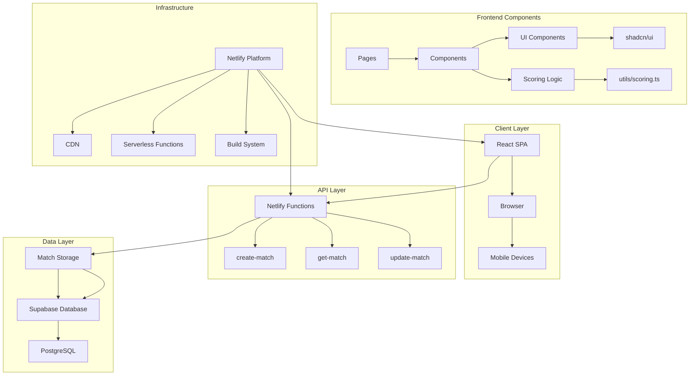

# Tennis Score Sharer - System Architecture

## Architecture Overview

The Tennis Score Sharer is a modern web application built with a serverless architecture that enables real-time tennis match scoring and sharing. The system is designed for scalability, reliability, and ease of deployment. The application has been optimized with clean code practices, removing debug logs and improving performance.

## System Architecture Diagram



## Detailed Component Architecture

### 1. Frontend Architecture

```
src/
├── App.tsx                 # Main application router
├── pages/                  # Route-based components
│   ├── Home.tsx           # Landing page
│   ├── NewMatch.tsx       # Match creation interface
│   ├── ScoreMatch.tsx     # Admin scoring interface
│   ├── ViewMatch.tsx      # Public match viewer
│   ├── TestScoring.tsx    # Test scoring interface
│   └── TestAPI.tsx        # Test API endpoints
├── components/             # Reusable UI components
│   ├── ui/                # shadcn/ui components
│   │   ├── button.tsx     # Button component
│   │   └── card.tsx       # Card component
│   ├── scoring/           # Scoring-specific components
│   │   ├── GameScorer.tsx # Main scoring interface
│   │   └── Scoreboard.tsx # Scoreboard display
│   └── shared/            # Common components
│       ├── QRCodeModal.tsx # QR code generation
│       └── TennisBallIcon.tsx # Tennis ball icon
├── services/              # API integration layer
│   └── api.ts            # HTTP client for Netlify functions
├── utils/                 # Business logic
│   └── scoring.ts        # Tennis scoring algorithms
├── types/                 # TypeScript type definitions
│   └── Scoring.ts        # Tennis scoring types
├── hooks/                 # Custom React hooks
│   └── useMatchUpdates.ts # Real-time updates
├── lib/                   # Library configurations
│   ├── colors.ts         # Tennis color scheme
│   ├── supabase.ts       # Supabase client
│   └── utils.ts          # Utility functions
└── styles/                # Global styles
    └── index.css         # Global CSS
```

### 2. Backend Architecture

```
netlify/functions/
├── create-match.ts        # Match creation endpoint
├── get-match.ts          # Match retrieval endpoint
├── update-match.ts       # Match update endpoint
└── shared/
    └── storage.ts        # Database abstraction layer
```

### 3. Data Flow

1. **Match Creation Flow**:
   ```
   User Input → React Form → API Call → Netlify Function → Supabase → Match Created
   ```

2. **Real-time Updates Flow**:
   ```
   Score Update → API Call → Netlify Function → Supabase → Polling → UI Update
   ```

3. **Match Viewing Flow**:
   ```
   URL Access → React Router → API Call → Supabase → Match Data → UI Render
   ```

## Technology Stack

### Frontend
- **React 19** - Modern React with hooks and functional components
- **TypeScript** - Type-safe development
- **React Router** - Client-side routing
- **Tailwind CSS** - Utility-first CSS framework
- **shadcn/ui** - Modern UI component library
- **Lucide React** - Icon library

### Backend
- **Netlify Functions** - Serverless API endpoints
- **Supabase** - PostgreSQL database with real-time capabilities
- **TypeScript** - Type-safe server-side code

### Infrastructure
- **Netlify** - Hosting, CDN, and serverless platform
- **Supabase** - Database hosting and management
- **GitHub** - Version control and CI/CD

## Key Design Patterns

### 1. Serverless Architecture
- **Stateless Functions**: Each API endpoint is independent
- **Event-Driven**: Functions triggered by HTTP requests
- **Auto-Scaling**: Netlify handles scaling automatically

### 2. Real-time Updates
- **Polling Strategy**: Currently using 2-second polling intervals
- **Future Enhancement**: Planning WebSocket or Server-Sent Events
- **Optimistic Updates**: UI updates immediately, syncs with server

### 3. Type Safety
- **Shared Types**: TypeScript interfaces shared between frontend and backend
- **API Contracts**: Strict typing for all API calls
- **Runtime Validation**: Input validation on both client and server

### 4. Component Architecture
- **Atomic Design**: UI components built from atoms to pages
- **Composition**: Components composed of smaller, reusable pieces
- **Separation of Concerns**: Business logic separated from UI components

## Security Considerations

### 1. Authentication & Authorization
- **Admin Tokens**: Unique tokens for match administrators
- **Token Verification**: Server-side validation of admin permissions
- **Public Access**: Read-only access for match viewers

### 2. Data Protection
- **Input Validation**: All user inputs validated on server
- **SQL Injection Prevention**: Parameterized queries via Supabase
- **CORS Configuration**: Proper CORS headers for API access

### 3. Environment Security
- **Environment Variables**: Sensitive data stored in Netlify environment
- **Service Keys**: Supabase service role keys for server operations
- **Public Keys**: Client-side operations use public keys only

## Performance Optimizations

### 1. Frontend Performance
- **Code Splitting**: React Router enables lazy loading
- **Bundle Optimization**: Tree shaking and minification
- **Caching**: Browser caching for static assets

### 2. Backend Performance
- **Connection Pooling**: Supabase handles database connections
- **Query Optimization**: Efficient database queries
- **CDN**: Netlify CDN for global content delivery

### 3. Real-time Performance
- **Polling Optimization**: Efficient polling intervals
- **Data Transfer**: Minimal payload sizes
- **Caching**: Client-side caching of match data

## Scalability Considerations

### 1. Horizontal Scaling
- **Serverless**: Automatic scaling based on demand
- **Database**: Supabase handles database scaling
- **CDN**: Global content delivery

### 2. Data Management
- **Database Design**: Optimized schema for tennis matches
- **Indexing**: Proper database indexing for queries
- **Archiving**: Strategy for old match data

### 3. Monitoring & Observability
- **Logging**: Comprehensive logging in Netlify functions
- **Error Tracking**: Error monitoring and alerting
- **Performance Monitoring**: Response time tracking

## Deployment Architecture

### 1. Development Environment
- **Local Development**: React dev server + Netlify dev
- **Hot Reloading**: Instant feedback during development
- **Environment Variables**: Local configuration management

### 2. Production Environment
- **Build Process**: Automated builds on Git push
- **Deployment**: Automatic deployment to Netlify
- **Environment Management**: Production environment variables

### 3. CI/CD Pipeline
- **GitHub Integration**: Automatic builds on push
- **Testing**: Automated testing before deployment
- **Rollback**: Easy rollback to previous versions

## Future Enhancements

### 1. Real-time Communication
- **WebSocket Integration**: Replace polling with WebSockets
- **Server-Sent Events**: Alternative real-time solution
- **Push Notifications**: Mobile push notifications

### 2. Advanced Features
- **User Authentication**: User accounts and profiles
- **Match History**: Persistent match storage
- **Statistics**: Advanced tennis statistics
- **Social Features**: Sharing and social integration

### 3. Performance Improvements
- **Service Workers**: Offline functionality
- **Progressive Web App**: PWA capabilities
- **Mobile App**: Native mobile applications

## Conclusion

The Tennis Score Sharer architecture is designed for modern web development best practices, with a focus on scalability, maintainability, and user experience. The serverless approach provides cost-effective scaling while the TypeScript stack ensures type safety and developer productivity. 